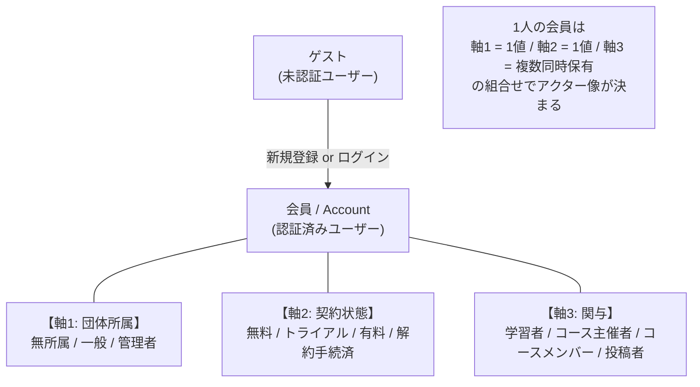
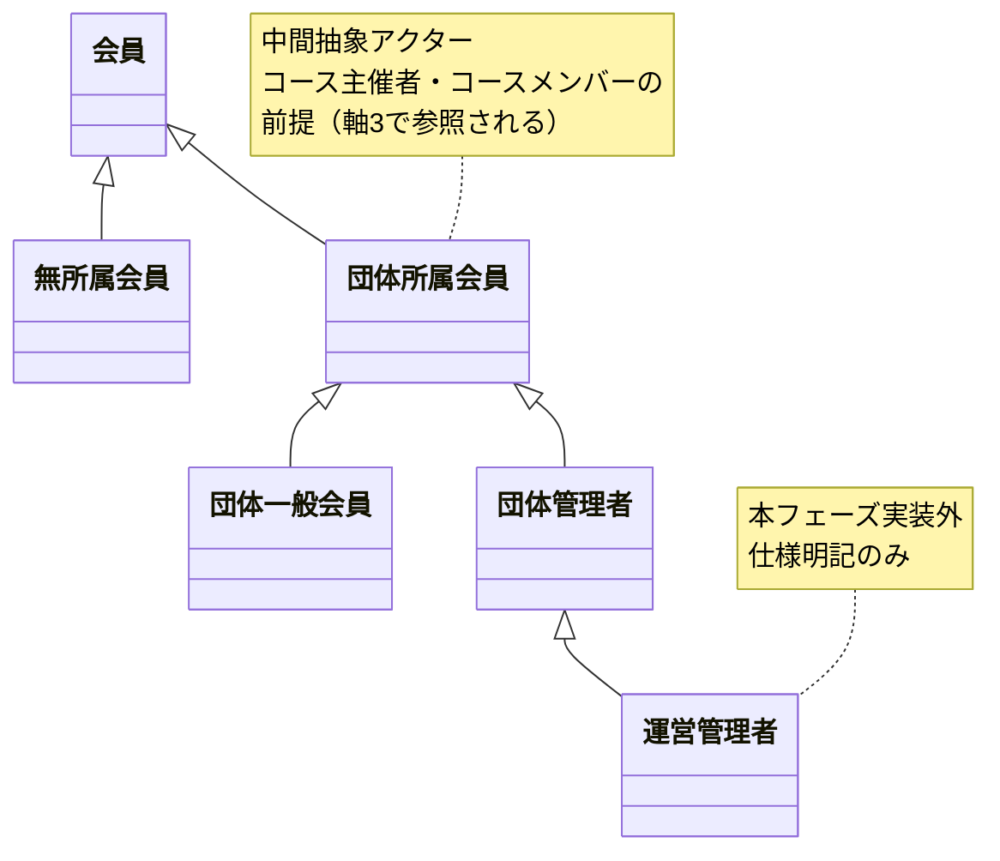
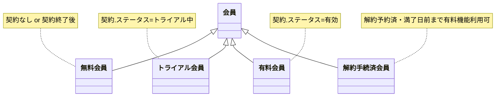
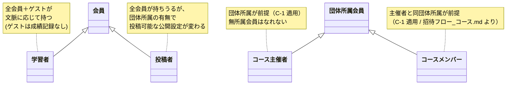

# ちょい英語 学習者アプリ アクター整理（v1.1）

最終更新：2026年5月13日
対象バージョン：**v1.1（残論点 P-A1〜P-A6 全件確定）**
依拠する概念モデル：v13（学習者アプリ 概念モデル設計）
依拠するユースケース仕様：投稿システム Pages.md（UC-01〜UC-52）
進捗位置：STEP 3（アクター整理）の成果物。STEP 4（ユースケース図）の前提資料

---

## 0. 本資料の目的

本資料は、ユースケース図作成（STEP 4）の前段として、学習者アプリにおけるアクター（システムと関わるユーザーロール）を一覧・定義する。

**SSoT原則：** アクターの定義はここを単一の典拠とする。ユースケース図側ではアクター名のみを参照し、定義の重複は避ける。

**前段の成果物との関係：**

| 資料 | 役割 |
|---|---|
| 学習者アプリ_概念モデル図 v13（8図） | エンティティ構造のSSoT |
| 投稿システム Pages.md / 投稿データ仕様 / 招待フロー（団体・コース） | 投稿システム側ユースケースの正典 |
| **本資料（アクター整理 v1.1）** | **学習者アプリ アクターのSSoT** |
| 学習者アプリ_ユースケース図 v1（次フェーズ） | アクター × UC の対応の可視化 |

---

## 1. スコープ確認

### 1.1 スコープ境界

「**スコープ**」= 今回作るユースケース図に「含める範囲」と「含めない範囲」の線引き。

**スコープ内：1人の会員が学習者・主催者・投稿者・契約者として使う機能**

| 機能群 | 対応画面 |
|---|---|
| 学習者として学ぶ | B-01〜B-07 |
| 自分のコースを管理する | A-MC1／A-MC2／A-MC3、A-CM1／A-CM2 |
| 自分のユニットを投稿・管理する | A-MU1／A-MU2／A-MU3 |
| アクセスハブ | A-P1 |
| 学習成果（成績記録・弱点補強リスト） | システム振る舞い＋関連UC |
| タイムライン（配信・3種別閲覧） | （配信UI／B-01内タブ） |
| 課金（契約・支払い・通知受領） | プラン契約導線 |
| 認証（ログイン・OAuth・OTP・パスワードリセット） | 認証画面群 |
| 被招待者承諾フロー（UC-50/51、UC-15 拡張） | 専用承諾画面 |

**スコープ外：団体管理者として団体全体を管理する機能**

| 機能群 | 対応画面 / UC |
|---|---|
| 団体情報の編集 | A-T1／A-T2、UC-01／UC-02 |
| 団体メンバーの一覧・招待・削除 | A-M1／A-M2／A-M3、UC-03／UC-04／UC-05 |
| **招待状態の一覧管理・再送（UC-52）** | A-M1 内、UC-52 |
| 団体コースへの介入編集 | A-C1／A-C2、UC-18／UC-19 |
| 団体ユニットへの介入編集 | A-U1／A-U2、UC-27／UC-28 |
| 運営管理者の他団体管理機能 | 将来フェーズ、UC-60〜65 |
| トピックメーカー識別フラグ設定 | 運用ツール経由、UC-06 |

### 1.2 アクター化方針（既決事項）

| 項目 | 方針 |
|---|---|
| 軸数 | **3軸を直交させる**（団体所属軸／契約状態軸／関与軸） |
| 軸1：団体所属 | **アクター化する**（無所属／一般／管理者）。画面遷移とUI出し分けに直結する重要構造 |
| 軸2：契約状態 | **アクター化する**（無料／トライアル／有料／解約手続済）。停止・予約は除外（事前条件で扱う） |
| 軸3：関与 | **アクター化する**（学習者／コース主催者／コースメンバー／投稿者） |
| コース主催者・メンバーの団体所属制約 | **汎化として組み込む**（C-1 採用）。「団体所属会員」からのサブアクターとして定義 |
| ゲスト | **独立アクター化する**（未認証ユーザー） |
| ゲストの閲覧 | **可能**（P-A1 確定）。ただし学習成果（カード成績／単語成績／弱点補強リスト）は記録されない |
| 外部システム（Stripe／OAuthプロバイダ） | アクター化しない |
| 運営管理者 | 仕様明記のみ。UCには登場させない（P-A3 確定） |
| 被招待者 | 独立アクター化しない。ゲスト／会員のサブシナリオとして扱う（P-A2 確定） |
| 自動生成（TTS／AI画像）完了通知 | システム自動。能動UCとしては描かない（P-A4 確定） |
| システム発火イベント（ランキング登録通知等） | **学習者の受動UCとして楕円で描く**（P-A5 案A 確定） |

---

## 2. 3軸モデルの全体像

学習者アプリのアクターは「ゲスト」と「会員」の2系統に分かれ、会員はさらに3つの独立した軸で特化される。

**軸の独立性のポイント：**

- 軸1・軸2 はそれぞれ会員に必ず1値ずつ付与される（mutually exclusive within axis）
- 軸3 は文脈に応じて複数を同時に持てる（例：自分のコースを学習しながら別コースのメンバーとして投稿、同時に第三のコースの主催者でもある）
- 「団体所属の有料会員が、コース主催者として配信する」のように軸を組み合わせて具体的シーンが決まる

---

## 3. アクター一覧

### 3.1 ゲスト（独立アクター）

| 項目 | 内容 |
|---|---|
| 定義 | ちょい英語アカウントを保有していない、またはログインしていないユーザー |
| 親アクター | なし（独立アクター） |
| 主要UC | **新規登録**（メール／OAuth）、**ログイン**（パスワード／OTP／OAuth）、**パスワードリセット**、**被招待者としての承諾**（UC-51／UC-15拡張のアカウント未取得パターン）、**コンテンツ閲覧**（UC-30〜34、UC-42相当の閲覧系）。**ただし学習成果は記録されない** |
| スコープ判定 | スコープ内 |
| 備考 | ログイン成功時には軸1の「無所属会員／団体一般会員／団体管理者」のいずれかに遷移する |

### 3.2 会員（抽象基底アクター）

| 項目 | 内容 |
|---|---|
| 定義 | ちょい英語アカウントを保有し、認証済みのユーザー。すべての特化アクターの抽象基底 |
| 親アクター | （抽象） |
| 主要UC（共通） | ログアウト、プロフィール編集（ニックネーム／ユーザーアイコン／自己紹介／URL）、メール変更、パスワード変更、アカウント削除（無所属時のみ・本仕様スコープ外） |
| スコープ判定 | スコープ内 |
| 備考 | 直接登場するアクターではなく、3軸の特化アクターの共通母体として概念化する |

### 3.3 軸1：団体所属（C-1 適用：汎化として組み込む）

**汎化関係：**

**アクター定義：**

| アクター | 定義（属性条件） | 学習者アプリスコープでの主要UC |
|---|---|---|
| 無所属会員 | Account.所属団体 = null | 学習活動全般、お気に入り・コメント、コース非帰属ユニットの投稿、団体招待承諾（UC-50/51） |
| 団体一般会員 | Account.団体ロール = 一般 | 無所属会員のUC全て＋マイコース作成、コース招待受諾、団体限定公開コンテンツの閲覧 |
| 団体管理者 | Account.団体ロール = 管理者 | 団体一般会員と同等の **個人活動UC**。団体管理機能（A-T／A-M／A-C／A-U）はスコープ外 |
| 運営管理者 | isトピックメーカー団体の団体管理者 | 仕様明記のみ。UCには登場させない |

**重要な制約：**

- 「団体所属会員」は中間抽象アクター。直接UCに現れることは少ないが、コース主催者・コースメンバーの汎化元として参照される
- 団体管理者であっても、学習者アプリのスコープでは「自分のコース・ユニットを管理する個人会員」として扱う。介入編集権限（UC-19／UC-28）はスコープ外
- 運営管理者は仕様としては「他団体管理機能を持つ」が、本フェーズの学習者アプリには登場しない

### 3.4 軸2：契約状態

**汎化関係：**

**アクター定義：**

| アクター | 定義（契約.ステータス） | 主要UC |
|---|---|---|
| 無料会員 | 契約なし（一度も契約していない or 契約終了後） | プラン契約、トライアル開始（未使用の場合） |
| トライアル会員 | トライアル中 | トライアルキャンセル、カード情報変更、自動的な有料移行（システム側） |
| 有料会員 | 有効 | 解約申込、カード情報変更、メール通知受領、有料機能の利用 |
| 解約手続済会員 | 解約手続済（キャンセル日時記録済・契約満了日前） | 解約予約キャンセル、満了日まで有料機能利用 |

**アクター化しない契約状態（P-A1 関連、A の確定事項）：**

- **停止**（契約.ステータス=停止）：支払い滞納による強制停止。能動的UCはない。事前条件「契約.ステータス ≠ 停止」または例外フローで扱う
- **予約**（契約.ステータス=予約）：次に発効する契約。能動的UCはない。状態遷移として扱う

### 3.5 軸3：関与（C-1 適用：コース系は団体所属からの派生）

**汎化関係：**

**アクター定義：**

| アクター | 定義（関係条件） | 主要UC |
|---|---|---|
| 学習者 | 投稿コンテンツを閲覧・学習する文脈に立つユーザー。ゲストもこの文脈に立てる（ただし成績記録なし） | UC-30〜34（コース一覧／ユニット一覧／検索／フラッシュカード学習）、UC-40〜45（お気に入り・コメント）※会員のみ、タイムライン3種別の閲覧、**学習成果通知受領**（受動UC・P-A5）、**システム発火イベント受領**（例：ランキング登録通知、弱点補強リスト追加通知） |
| コース主催者 | コースに対する Account → コース [主催] 関係を持つ会員。**団体所属が前提** | UC-10 コース作成、UC-11 編集、UC-12 公開設定、UC-13 投稿者制限、UC-14 制約値参照、UC-15 メンバー招待、UC-15a 主催者移譲、UC-16 表示順、UC-17 削除、配信操作 |
| コースメンバー | コースに対する Account o-- コース [メンバー] 関係を持つ会員。**主催者と同団体所属が前提** | UC-15 招待受諾、所属コースへのユニット投稿（投稿者制限の範囲内） |
| 投稿者 | Account → Unit [投稿] 関係を持つ会員。条件分岐あり（下記） | UC-20 投稿、UC-21 編集、UC-22 差分更新、UC-23 ダウンロード、UC-24 コース帰属、UC-25 表示順、UC-26 削除、配信操作。**自動生成完了通知**はシステム自動のためUC化しない（P-A4） |

**「投稿者」の成立条件（Pages.md より）：**

投稿者は次のいずれかに該当する会員：

- (a) コース主催者として、自コースに投稿する
- (b) コースメンバーとして、所属コースに投稿する（コースの投稿者制限が「メンバー」「一般」の場合）
- (c) 投稿者制限が「一般」のコースに投稿する任意の会員
- (d) **コース非帰属ユニットを投稿する任意の会員**（無所属会員もここに該当）

この (d) があるため、投稿者は団体所属を必須としない。ただし「団体限定公開で投稿」は無所属会員には不可能（事前条件）。

---

## 4. アクター × UCグループ対応マトリクス

ユースケース図の分割は U-1〜U-7 の7群とする（前回確定）。各UC群に対する主アクターを ● で示す。

| UC群 | ゲスト | 無所属 | 一般 | 管理者 | 無料 | トラ | 有料 | 解約 | 学習者 | 主催者 | メンバー | 投稿者 |
|---|:-:|:-:|:-:|:-:|:-:|:-:|:-:|:-:|:-:|:-:|:-:|:-:|
| U-1 認証・アカウント | ● | ● | ● | ● | – | – | – | – | – | – | – | – |
| U-2 契約・課金 | – | ● | ● | ● | ● | ● | ● | ● | – | – | – | – |
| U-3 閲覧・学習 | ●※1 | ● | ● | ● | – | – | – | – | ● | – | – | – |
| U-4 お気に入り／コメント／タイムライン閲覧 | ●※2 | ● | ● | ● | – | – | – | – | ● | – | – | – |
| U-5 マイコース運営 | – | – | ● | ● | – | – | – | – | – | ● | ● | – |
| U-6 マイユニット投稿 | – | ●※3 | ● | ● | – | – | – | – | – | – | – | ● |
| U-7 配信・公開操作 | – | – | ● | ● | – | – | – | – | – | ● | – | – |

**凡例：** ● = 主アクター／– = 該当しない

**注：**
- ※1 ゲストは閲覧のみ可能。フラッシュカード学習も可能だが学習成果（カード成績／単語成績）は記録されない（P-A1）
- ※2 ゲストはお気に入り登録・コメント投稿は不可（会員のみ）。タイムライン閲覧・コメント閲覧は可能
- ※3 無所属会員は U-6 のうち、コース非帰属ユニットの投稿のみ可能

---

## 5. 残論点（v1.1 で全件確定済み）

v1 で挙げた残論点 P-A1〜P-A6 は本バージョンで全件確定した。

| 番号 | 内容 | 確定内容 | 反映先 |
|---|---|---|---|
| P-A1 | 未ログイン閲覧の可否 | **閲覧可能、学習成果は残らない** | §1.2、§3.1、§3.5（学習者note）、§4（ゲスト列） |
| P-A2 | 被招待者の独立アクター化 | **独立化しない**。ゲストまたは会員のサブシナリオとして扱う | §1.2 |
| P-A3 | 運営管理者の扱い | **仕様明記のみ、UCに登場させない** | §1.2、§3.3 |
| P-A4 | 自動生成完了通知 | **システム自動、UC化しない** | §1.2、§3.5（投稿者note） |
| P-A5 | システム発火イベント（ランキング登録通知等） | **案A：学習者の受動UCとして楕円で描く** | §1.2、§3.5（学習者note） |
| P-A6 | 招待状態管理（UC-52）の境界 | **描かない**（A-M1 内のUC、スコープ外） | §1.1（スコープ外表に UC-52 を明示） |

---

## 6. 用語・関連資料

### 6.1 用語マッピング

| 既存実装 | 投稿システム Pages.md | 本資料 |
|---|---|---|
| Account | 会員 | 会員 |
| Book | ユニット | ユニット |
| Account.団体ロール=一般 | 団体一般会員 | 団体一般会員 |
| Account.団体ロール=管理者 | 団体管理者 | 団体管理者 |
| 契約.ステータス=トライアル中 | （課金は別系） | トライアル会員 |
| プレミアム会員 | （課金は別系） | 有料会員 |

### 6.2 関連資料

| 資料 | 内容 |
|---|---|
| 学習者アプリ_概念モデル設計_引き継ぎ資料_v13時点.md | エンティティ設計の経緯と現状 |
| 学習者アプリ_概念モデル図_v13_A〜C（8図） | エンティティ構造（SSoT） |
| 学習者アプリ_概念モデル図_v13_各図説明資料.md | 各図の解説 |
| ちょい英語ミニブック投稿システム_ユースケース仕様_Pages.md | UC-01〜52 の正典 |
| 投稿データ_メディアパック仕様.md | UC-20/22/23 の詳細 |
| 招待フロー_団体.md | UC-03／50／51／52 |
| 招待フロー_コース.md | UC-15 拡張 |
| 画面遷移図_*.svg（4ロール別） | 画面遷移の正典 |
| ちょい英語ミニブック投稿システム_ワイヤーフレーム.pdf | A画面群のUI詳細 |

---

## 付録：v1 → v1.1 変更点

| 章 | 変更内容 |
|---|---|
| §0 | 「全件確定」バージョンとして v1.1 に更新 |
| §1.1 | スコープ境界の説明を平易化（「スコープ」とは何か）。スコープ外の表に **UC-52 招待状態の一覧管理** を明示追加 |
| §1.2 | アクター化方針の表に P-A1（ゲスト閲覧可）、P-A4（自動生成通知）、P-A5（システム発火イベント案A）を追加 |
| §3.1 | ゲストの主要UCに「コンテンツ閲覧」を追加。「学習成果は記録されない」を明示 |
| §3.5 | 学習者noteに「ゲストも文脈に立てる（成績記録なし）」を追記。学習者の主要UCに「学習成果通知受領」「システム発火イベント受領」を追加。投稿者noteに自動生成通知の扱いを追記 |
| §4 | ゲスト列の U-3／U-4 に ● を追加（注釈付き）。注釈で「フラッシュカード学習も可能だが成績は記録されない」「お気に入り登録・コメントは会員のみ」を明示 |
| §5 | 残論点を「全件確定済み」として、各論点に確定内容と反映先を記載 |

---

## 付録：v1 までの判断記録

本資料の主要な判断は、引き継ぎ前スレッドおよび本スレッドでの議論を経て以下のように確定した。

| 質問 | 確定内容 |
|---|---|
| A：停止会員・予約会員のアクター化 | アクター化せず、事前条件・例外フローで扱う |
| B：ゲストの独立アクター化 | 独立アクター化する |
| C：コース主催者の団体所属制約 | C-1（汎化として組み込む）。コース主催者・メンバーは「団体所属会員」のサブアクター |
| D：3軸モデル＋団体所属軸のアクター化 | 全て採用。3軸を直交させ、団体所属軸もアクター化 |

---

**本資料は STEP 3（アクター整理）の成果物 v1.1。次の STEP 4 では、本資料の §4 対応マトリクスをベースに、U-1〜U-7 の7枚のユースケース図を作成する。**
