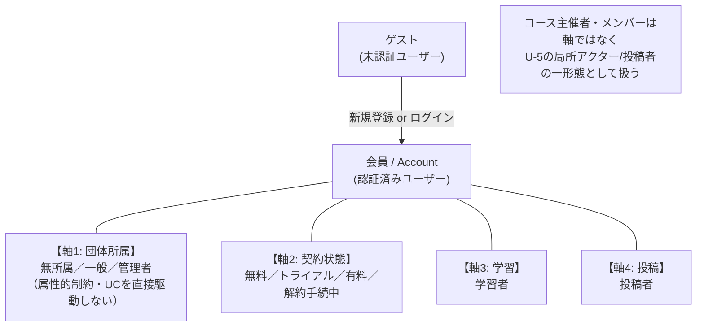
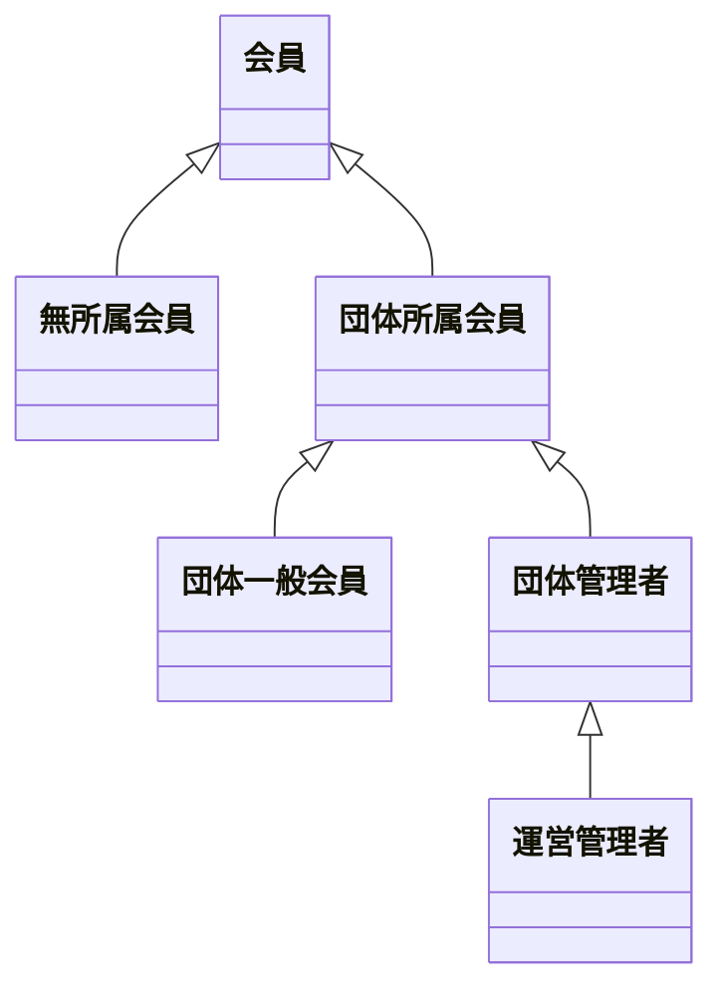
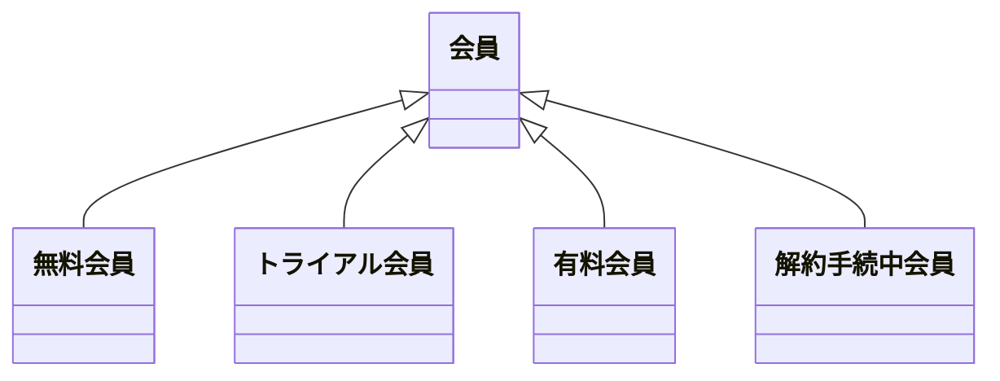
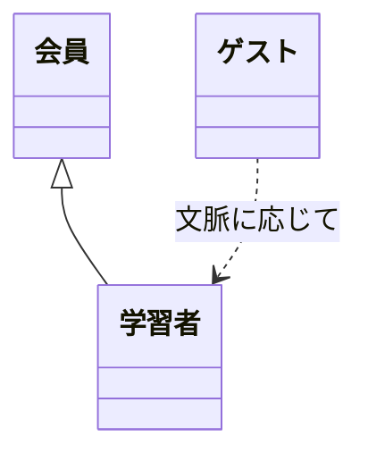
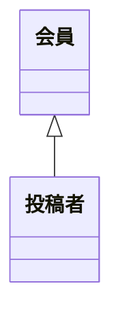

# ちょい英語 学習者アプリ アクター整理（v1.2）

最終更新：2026年5月13日
対象バージョン：**v1.2（軸構造修正・図との整合性確保）**
依拠する概念モデル：v13
依拠するユースケース仕様：投稿システム Pages.md（UC-01〜UC-52）

---

## 0. 本資料の目的

ユースケース図 v2（U-1〜U-7）のSSoT。アクター定義はここを単一の典拠とする。

**v1.1 → v1.2 の主な変更点：**

- **軸3 を分割**：軸3=学習者、軸4=投稿者 の2軸に
- **コース主催者・メンバーは軸から外す**：
  - コース主催者は **U-5 図内の局所アクター** として残す
  - コースメンバーは **「投稿者」の一形態**（事前条件で識別）として扱う
- **全体俯瞰の軸1からUC群への線を削除**：軸1（団体所属）は属性的制約として働くため、UCを直接駆動しない
- **抽象「会員」箱を U-3/U-4/U-5/U-6 から削除**：図の冗長を解消
- **「解約手続済会員」→「解約手続中会員」** に改称
- **ゲストの権限差をユースケース図上で明示**：閲覧系のみ。お気に入り系・コメント投稿系には線を引かない

---

## 1. スコープ確認

### 1.1 スコープ境界

**スコープ内：1人の会員が学習者・主催者・投稿者・契約者として使う機能**

| 機能群 | 対応画面 |
|---|---|
| 学習者として学ぶ | B-01〜B-07 |
| 自分のコースを管理する | A-MC1／A-MC2／A-MC3、A-CM1／A-CM2 |
| 自分のユニットを投稿・管理する | A-MU1／A-MU2／A-MU3 |
| アクセスハブ | A-P1 |
| 学習成果（成績記録・弱点補強リスト） | システム振る舞い＋関連UC |
| タイムライン（配信・3種別閲覧） | （配信UI／B-01内タブ） |
| 課金（契約・支払い・通知受領） | プラン契約導線 |
| 認証（ログイン・OAuth・OTP・パスワードリセット） | 認証画面群 |
| 被招待者承諾フロー（UC-50/51、UC-15 拡張） | 専用承諾画面 |

**スコープ外：団体管理者として団体全体を管理する機能** （A-T／A-M／A-C／A-U系、UC-01〜06／18／19／27／28／52、運営管理者の他団体管理、UC-06）

### 1.2 アクター化方針

| 項目 | 方針 |
|---|---|
| 軸1：団体所属 | アクター化する（無所属／一般／管理者）。**ただしUCを直接駆動しない（属性的制約）** |
| 軸2：契約状態 | アクター化する（無料／トライアル／有料／**解約手続中**） |
| 軸3：学習 | アクター化する（**学習者のみ**） |
| 軸4：投稿 | アクター化する（**投稿者のみ**） |
| コース主催者 | **U-5 図内の局所アクター**。全体俯瞰の軸からは外す |
| コースメンバー | **アクター化しない**。「投稿者」の一形態（事前条件で識別） |
| ゲスト | 独立アクター化 |
| ゲストの閲覧 | 可能、ただし学習成果は記録されない |
| 自動生成完了通知 | システム自動、UC化しない |
| システム発火イベント | 学習者の受動UCとして楕円で描く |
| 外部システム | Stripe／OAuthプロバイダはアクター化しない |
| 運営管理者 | 仕様明記のみ、UCに登場させない |
| 被招待者 | 独立アクター化しない（ゲスト／会員のサブシナリオ） |

---

## 2. 4軸モデルの全体像

**軸の独立性：**

- 軸1・軸2：会員に必ず1値ずつ付与
- 軸3・軸4：文脈に応じて持つ（ゲストも軸3=学習者になれる、会員は両方持てる）

---

## 3. アクター一覧

### 3.1 ゲスト

| 項目 | 内容 |
|---|---|
| 定義 | ちょい英語アカウントを保有していない、またはログインしていないユーザー |
| 親アクター | なし |
| 主要UC | 新規登録、ログイン、パスワードリセット、被招待者承諾、**コンテンツ閲覧（成績記録なし）、タイムライン閲覧（お気に入りタイムライン除く）、コメント閲覧** |
| 備考 | お気に入り登録・コメント投稿・お気に入りタイムライン閲覧は不可（会員のみ） |

### 3.2 会員（抽象基底）

| 項目 | 内容 |
|---|---|
| 定義 | 認証済みユーザー。すべての特化アクターの抽象基底 |
| 主要UC（共通） | ログアウト、プロフィール編集、メール変更、パスワード変更 |
| 備考 | **U-3/4/5/6 の図内には登場させない**（軸別の特化アクターを直接使う） |

### 3.3 軸1：団体所属（属性的制約）

**ロール定義：**

| アクター | 定義 |
|---|---|
| 無所属会員 | Account.所属団体 = null |
| 団体一般会員 | Account.団体ロール = 一般 |
| 団体管理者 | Account.団体ロール = 管理者 |
| 運営管理者 | isトピックメーカー団体の団体管理者（仕様明記のみ） |

**重要：** 軸1は **UCを直接駆動しない**。「無所属会員はコースを作成できない」のような制約は、UCの事前条件として表現される（例：UC-10 の事前条件「実行会員は団体所属である」）。

### 3.4 軸2：契約状態

| アクター | 定義 |
|---|---|
| 無料会員 | 契約なし |
| トライアル会員 | トライアル中 |
| 有料会員 | 有効 |
| 解約手続中会員 | 解約申込済・満了日前 |

停止・予約はアクター化せず、事前条件・例外フローで扱う。

### 3.5 軸3：学習

| アクター | 定義 | 主要UC |
|---|---|---|
| 学習者 | 投稿コンテンツを閲覧・学習する文脈に立つユーザー。ゲストも会員も該当 | UC-30〜34、UC-40〜45（一部）、タイムライン閲覧、学習成果記録（会員のみ）、弱点補強リスト閲覧、問題セット復習 |

### 3.6 軸4：投稿

| アクター | 定義 | 主要UC |
|---|---|---|
| 投稿者 | Account → Unit [投稿] 関係を持つ会員 | UC-20〜26、配信操作（U-7） |

**「投稿者」の成立条件（Pages.md より、事前条件で表現）：**

- (a) コース主催者として自コースに投稿する
- (b) コースメンバーとして所属コースに投稿する（投稿者制限が「メンバー」「一般」の場合）
- (c) 投稿者制限が「一般」のコースに投稿する任意の会員
- (d) コース非帰属ユニットを投稿する任意の会員

### 3.7 局所アクター：コース主催者（U-5 専用）

| 項目 | 内容 |
|---|---|
| 定義 | コースに対する Account → コース [主催] 関係を持つ会員 |
| 制約 | 団体所属が前提（無所属は不可）。事前条件 |
| 適用範囲 | **U-5 マイコース運営 図内でのみ局所的に使用** |
| 主要UC | UC-10〜17、UC-15a |
| 備考 | 全体俯瞰の軸には登場しない。U-5 を独立して読むときのみアクターとして見える |

### 3.8 コースメンバー：アクター化しない

| 項目 | 内容 |
|---|---|
| 定義 | コースに対する Account o-- コース [メンバー] 関係を持つ会員 |
| 扱い | **アクター化しない**。U-6 の「投稿者」の一形態として、事前条件「対象コースのメンバーである」で識別される |
| 権限（Pages.md より確認） | (a) ユニット投稿・編集・削除（U-6 のUC範囲） |
| 招待受諾 | UC-15 拡張 として U-1 招待受諾フローに含まれる（被招待者として） |

---

## 4. アクター × UCグループ対応マトリクス（v1.2）

| UC群 | ゲスト | 無所属 | 一般 | 管理者 | 無料 | トラ | 有料 | 解約中 | 学習者 | 投稿者 | 主催者(U-5局所) |
|---|:-:|:-:|:-:|:-:|:-:|:-:|:-:|:-:|:-:|:-:|:-:|
| U-1 認証・アカウント | ● | ● | ● | ● | – | – | – | – | – | – | – |
| U-2 契約・課金 | – | ● | ● | ● | ● | ● | ● | ● | – | – | – |
| U-3 閲覧・学習 | ●※1 | ● | ● | ● | – | – | – | – | ● | – | – |
| U-4 お気に入り／コメント／タイムライン閲覧 | ●※2 | ● | ● | ● | – | – | – | – | ● | – | – |
| U-5 マイコース運営 | – | – | ● | ● | – | – | – | – | – | – | ● |
| U-6 マイユニット投稿 | – | ●※3 | ● | ● | – | – | – | – | – | ● | – |
| U-7 配信・公開操作 | – | – | ● | ● | – | – | – | – | – | ● | – |

**注：**
- ※1 ゲスト：閲覧のみ可能。学習成果は記録されない。弱点補強・問題セット・ランキング登録通知は会員のみ
- ※2 ゲスト：UC-45（コメント閲覧）、全体タイムライン、ユニット内タイムラインのみ可。お気に入り（UC-40/41/42）、コメント投稿（UC-43/44）、お気に入りタイムラインは不可
- ※3 無所属会員：コース非帰属ユニットの投稿のみ可

**注意（軸1の扱い）：**
- 軸1（無所属／一般／管理者）の ● は「該当アクターがUC群に登場する可能性がある」を示す
- ただし、軸1は **UCを直接駆動しない属性的制約**。例えば「無所属はコースを作成できない」は UC-10 の事前条件で表現
- 全体俯瞰では軸1からUC群への線を引かない

---

## 5. 残論点

| 番号 | 内容 | 状態 |
|---|---|---|
| P-A1〜P-A6 | アクター整理 v1.1 の論点 | 全件確定済み |
| P-U2-1 | プラン種類（現在1種、将来複数） | 仕様未確定 |
| P-U2-2 | カード情報の新規登録UI | 仕様未確定 |
| P-U2-3 | 即時解約の有無 | 仕様未確定（現状アカウント削除時のみ） |
| P-U3-1 | 弱点補強リストのUI画面 | 画面未確定 |
| P-U3-2 | 問題セット復習のUI画面 | 画面未確定 |
| P-U7-1 | デッキ表示／非表示の操作画面 | 画面未確定 |

---

## 6. v1.1 → v1.2 差分

| 章 | v1.1 | v1.2 |
|---|---|---|
| 軸構造 | 軸3=関与（学習者／主催者／メンバー／投稿者） | 軸3=学習、軸4=投稿 に分割。主催者・メンバーは軸から外す |
| コース主催者 | 軸3 内の特化アクター（団体所属会員のサブ） | U-5 局所アクターとして残す |
| コースメンバー | 軸3 内の特化アクター | アクター化しない。「投稿者」の一形態（事前条件） |
| 軸1のUCへの線 | あり | なし（属性的制約として扱う） |
| 抽象「会員」箱 | U-3/4/5/6 の図に表示 | 削除 |
| U-2 アクター名 | 解約手続済会員 | **解約手続中会員** |
| ゲストの権限差 | アクター整理本文にのみ記述 | 図にも明示（U-3/U-4 の線の引き分け） |
| UC-N3.3/N3.4 | 「Member（抽象）」から線 | 「学習者」から線 |

---

**本資料は ユースケース図 v2（U-1〜U-7）のSSoT。**
