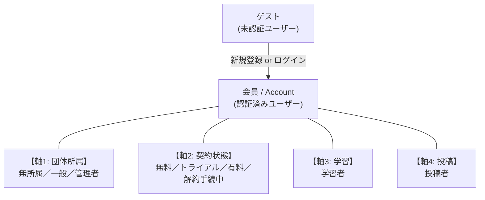
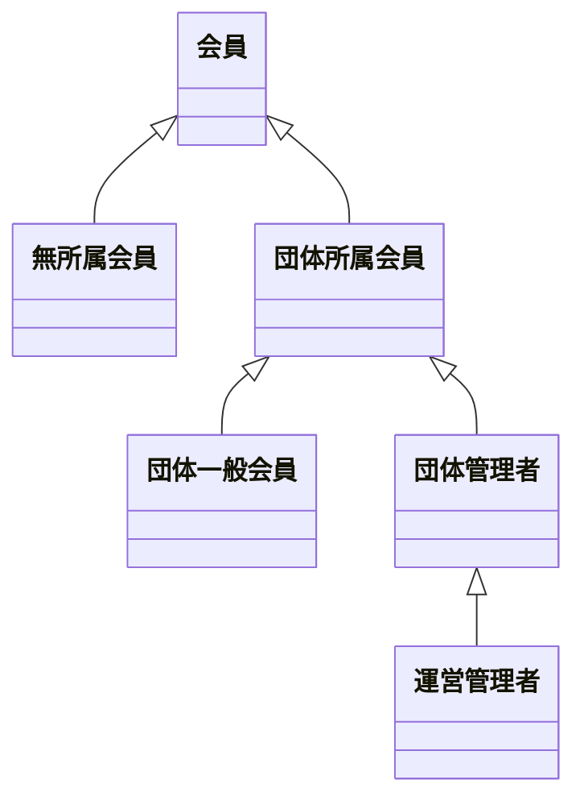

# ちょい英語 学習者アプリ アクター整理

最終更新：2026年6月9日
対象バージョン：**v1.4（投稿システム bc5cf1e 追従：被招待者UCを承諾／辞退に整理）**
依拠する概念モデル：v15
依拠するユースケース仕様：投稿システム Pages.md（UC-01〜UC-52、62cb317 ＋ bc5cf1e 反映）

> **本資料はGitHub上書き運用のため、ファイル名にはバージョン番号を付けない。**

---

## 0. 本資料の目的

ユースケース図のSSoT。アクター定義はここを単一の典拠とする。

**v1.3 → v1.4 の変更点（投稿システム bc5cf1e 追従）：**
- §3.1 ゲストの主要UC「被招待者承諾」を **「団体招待の承諾（UC-51 アカウント作成パス）」と「招待の辞退（ログイン不要）」** に整理。コース招待の承諾はログイン必須・会員のみのためゲストからは除外
- §1.1 スコープの被招待者承諾フローの画面表記を **IV-1（団体）／IV-2（コース）** に更新（旧 B-0/B-1 → IV系リネーム）

**v1.2 → v1.3 の変更点：**
- §3.6 投稿者の成立条件を **4種→3種** に修正（投稿システム 62cb317 で UC-13 投稿者制限が2値化されたため、旧(c)「投稿者制限『一般』のコースへの投稿者」を削除）

**v15 概念モデル対応で変更があったか：**

| 項目 | v15概念モデル変更 | アクター整理への影響 |
|---|---|---|
| 配信→配信コンテナ改名 | あり | なし（アクターレベルの変更ではない） |
| 配信単位拡張（コース／ユニット／パート／デッキ） | あり | なし（投稿者は変わらず） |
| プレイヤーエンティティ追加 | あり | なし（プレイヤーはUI概念） |
| ミニブック→ユニット用語統一 | あり | なし（既にユニット表記） |

→ **アクター構造は v1.1 → v1.2 → v1.3 で本文の修正は §3.6 のみ。軸モデルは維持。**

---

## 1. スコープ確認

### 1.1 スコープ境界

**スコープ内：1人の会員が学習者・主催者・投稿者・契約者として使う機能**

| 機能群 | 対応画面 |
|---|---|
| 学習者として学ぶ | B-01〜B-07 |
| 自分のコースを管理する | A-MC1／A-MC2／A-MC3、A-CM1／A-CM2 |
| 自分のユニットを投稿・管理する | A-MU1／A-MU2／A-MU3 |
| アクセスハブ | A-P1 |
| 学習成果 | システム振る舞い＋関連UC |
| タイムライン3種別（グローバル／お気に入り／ユニット） | （配信UI／B-01内タブ） |
| 課金 | プラン契約導線 |
| 認証 | 認証画面群 |
| 被招待者の承諾／辞退フロー | 公開ランディング IV-1（団体）／IV-2（コース）。承諾＝ログイン必須、辞退＝ログイン不要 |
| **配信コンテナ操作（v15対応）** | **配信設定画面（ギアアイコン>配信設定）** |

**スコープ外：** A-T／A-M／A-C／A-U 系（団体管理コンソール）、UC-01〜06／18／19／27／28／52、運営管理者の他団体管理

### 1.2 アクター化方針

| 項目 | 方針 |
|---|---|
| 軸1：団体所属 | アクター化する（無所属／一般／管理者）。属性的制約として働く |
| 軸2：契約状態 | アクター化する（無料／トライアル／有料／解約手続中） |
| 軸3：学習 | アクター化する（学習者のみ） |
| 軸4：投稿 | アクター化する（投稿者のみ） |
| コース主催者 | U-5 図内の局所アクター |
| コースメンバー | アクター化しない。「投稿者」の一形態（事前条件で識別） |
| ゲスト | 独立アクター化 |
| ゲストの閲覧 | 可能、ただし学習成果は記録されない |
| 自動生成完了通知 | システム自動、UC化しない |
| システム発火イベント | 学習者の受動UCとして楕円で描く |
| 外部システム | Stripe／OAuthプロバイダはアクター化しない |
| 運営管理者 | 仕様明記のみ、UCに登場させない |
| 被招待者 | 独立アクター化しない（ゲスト／会員のサブシナリオ） |

---

## 2. 4軸モデルの全体像

---

## 3. アクター一覧

### 3.1 ゲスト

| 項目 | 内容 |
|---|---|
| 定義 | ちょい英語アカウントを保有していない、またはログインしていないユーザー |
| 主要UC | 新規登録、ログイン、パスワードリセット、団体招待の承諾（UC-51 アカウント作成パス）、招待の辞退（団体／コース・ログイン不要）、コンテンツ閲覧（成績記録なし）、タイムライン閲覧（お気に入りタイムライン除く）、コメント閲覧 |
| 備考 | コース招待の承諾はログイン必須・会員のみのためゲストからは不可（投稿システム bc5cf1e） |

### 3.2 会員（抽象基底）

| 項目 | 内容 |
|---|---|
| 定義 | 認証済みユーザー。すべての特化アクターの抽象基底 |
| 主要UC（共通） | ログアウト、プロフィール編集、メール変更、パスワード変更 |
| 備考 | U-3/4/5/6 の図内には登場させない（直接特化アクターを使う） |

### 3.3 軸1：団体所属

| アクター | 定義 |
|---|---|
| 無所属会員 | Account.所属団体 = null |
| 団体一般会員 | Account.団体ロール = 一般 |
| 団体管理者 | Account.団体ロール = 管理者 |
| 運営管理者 | isトピックメーカー団体の団体管理者（仕様明記のみ） |

### 3.4 軸2：契約状態

| アクター | 定義 |
|---|---|
| 無料会員 | 契約なし |
| トライアル会員 | トライアル中（7日間） |
| 有料会員 | 有効 |
| 解約手続中会員 | 解約申込済・満了日前 |

### 3.5 軸3：学習

| アクター | 定義 |
|---|---|
| 学習者 | 投稿コンテンツを閲覧・学習する文脈に立つユーザー。ゲストも会員も該当 |

### 3.6 軸4：投稿

| アクター | 定義 |
|---|---|
| 投稿者 | Account → Unit [投稿] 関係を持つ会員 |

**成立条件3種（事前条件で識別）：**
- (a) コース主催者として自コースに投稿
- (b) コースメンバーとして所属コースに投稿（共同編集者：ユニット投稿・編集・削除が可能）
- (c) コース非帰属ユニットの投稿者

※ UC-13 投稿者制限の「一般」枠は廃止されたため、旧成立条件 (c)「投稿者制限『一般』のコースへの投稿者」は削除（投稿システム側 commit 62cb317 / 2026-06-03）

### 3.7 局所アクター：コース主催者（U-5 専用）

| 項目 | 内容 |
|---|---|
| 定義 | Account → コース [主催] 関係を持つ会員 |
| 制約 | 団体所属が前提 |
| 適用範囲 | U-5 マイコース運営 図内でのみ |
| 主要UC | UC-10〜17、UC-15a、コースメンバー除外 |

### 3.8 コースメンバー：アクター化しない

| 項目 | 内容 |
|---|---|
| 定義 | Account o-- コース [メンバー] 関係を持つ会員 |
| 扱い | アクター化しない。U-6 の「投稿者」の一形態として、事前条件「対象コースのメンバーである」で識別 |
| 権限 | (a) ユニット投稿・編集・削除（U-6 のUC範囲） |

---

## 4. アクター × UCグループ対応マトリクス

| UC群 | ゲスト | 無所属 | 一般 | 管理者 | 無料 | トラ | 有料 | 解約中 | 学習者 | 投稿者 | 主催者(U-5局所) |
|---|:-:|:-:|:-:|:-:|:-:|:-:|:-:|:-:|:-:|:-:|:-:|
| U-1 認証・アカウント | ● | ● | ● | ● | – | – | – | – | – | – | – |
| U-2 契約・課金 | – | ● | ● | ● | ● | ● | ● | ● | – | – | – |
| U-3 閲覧・学習 | ●※1 | ● | ● | ● | – | – | – | – | ● | – | – |
| U-4 お気に入り／コメント／タイムライン閲覧 | ●※2 | ● | ● | ● | – | – | – | – | ● | – | – |
| U-5 マイコース運営 | – | – | ● | ● | – | – | – | – | – | – | ● |
| U-6 マイユニット投稿 | – | ●※3 | ● | ● | – | – | – | – | – | ● | – |
| U-7 配信・公開操作 | – | – | ● | ● | – | – | – | – | – | ● | – |

**注：**
- ※1 ゲスト：閲覧のみ。学習成果記録なし。弱点補強・問題セット・ランキング登録通知は会員のみ
- ※2 ゲスト：UC-45（コメント閲覧）、グローバルタイムライン、ユニットタイムラインのみ可。お気に入り・コメント投稿・お気に入りタイムラインは不可
- ※3 無所属会員：コース非帰属ユニットの投稿のみ可

---

## 5. 残論点

| 番号 | 内容 |
|---|---|
| P-U2-1 | プラン種類の将来計画 |
| P-U2-2 | 無料会員のカード登録可否 |
| P-U2-3 | 即時解約の有無 |
| P-U3-1 | 弱点補強リストのUI画面 |
| P-U3-2 | 問題セット復習のUI画面 |
| **P-U7-1** | **コース／パート単位の配信の具体的な発火条件（v15で追加された配信単位）** |
| **P-U7-2** | **「対応プレイヤータイプ」がユニット属性かコース属性か、どこに保持するか** |

---

**本資料は ユースケース図（U-1〜U-7、U-1 は bc5cf1e 追従更新済み）のSSoT。**
