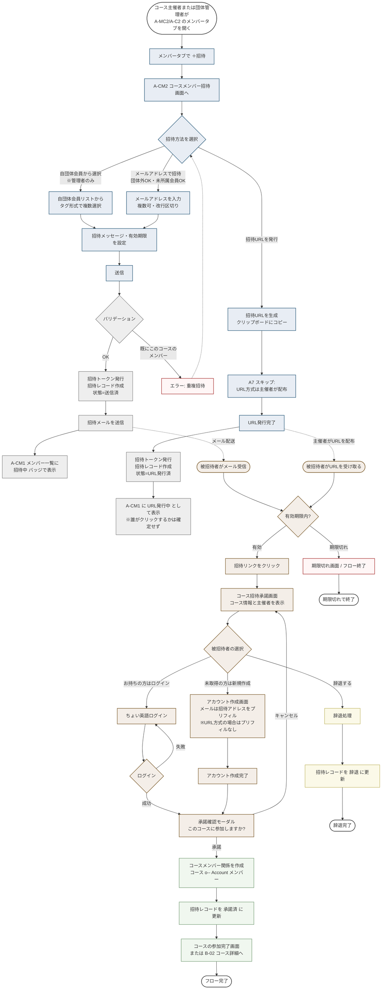
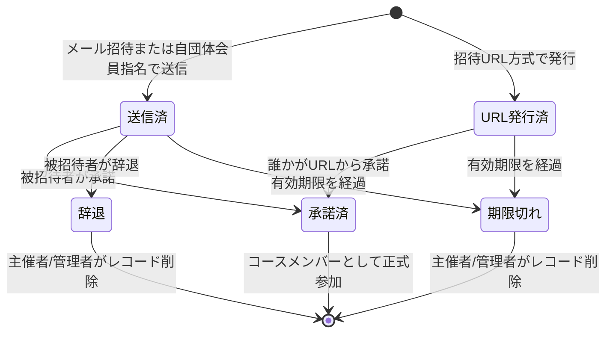

# コースへのメンバー招待フロー

対応ユースケース: UC-15(コースメンバー招待)、加えて被招待者側フロー(団体招待の UC-50/51/52 と類似)

## メインフロー

## 招待状態の遷移

## A-CM1 コースメンバー一覧での招待状態の表示

| 招待状態 | A-CM1 での表示 | 可能な操作 |
|---|---|---|
| 送信済 | 氏名 or メール + 「招待中」バッジ | 招待取消 / 再送信 |
| URL発行済 | 「URL発行中(使用状況不明)」バッジ | URL無効化 |
| 承諾済 | 通常のメンバーレコード | 除外 |
| 期限切れ | 氏名 or メール + 「期限切れ」バッジ | 再招待 / レコード削除 |
| 辞退 | 氏名 or メール + 「辞退」バッジ | レコード削除 |

## 団体招待フローとの差分

| 項目 | 団体招待(UC-03) | コース招待(UC-15) |
|---|---|---|
| 招待方法 | メール / 既存ID指名 / CSV一括 | 自団体会員選択 / メール / URL発行 |
| 被招待者の団体所属制約 | 別団体所属者は招待不可(1会員1団体) | 制約なし(団体所属問わず) |
| 招待元の権限 | 団体管理者のみ | 主催者本人 または 団体管理者 |
| 承諾時の効果 | Account.所属団体 / 団体ロール がセット | コース o-- Account メンバー関係が生成 |
| URL発行方式 | なし | あり(主催者が自分で配布) |
| 「自団体会員から選択」方式 | — | あり(団体管理者のみ) |

## 重要な設計ポイント

1. **招待URL方式の特殊性**
   - メール経由の招待と違い、被招待者が**事前に確定していない**
   - A-CM1 には「URL発行中」として1レコードのみ表示する(何人が受諾するか不明)
   - URL1つにつき1人の承諾で終わらせるか、複数人承諾を許すかは設計判断(下の未解決事項参照)

2. **自団体会員選択方式(管理者のみ)**
   - ドロップダウンから選んでタグとして追加
   - 内部的にはメール招待と同じトークン発行フローを踏むが、相手が特定できているので、招待メール内のリンクでログインさせる設計も可能(強い仮定: 自団体会員は既にちょい英語アカウントを持つ)

3. **コースメンバーに団体所属制約がない**
   - 団体未所属の外部会員もコースメンバーになれる
   - 異なる団体所属の会員もコースメンバーになれる
   - これは「コースの公開範囲」と独立した概念:公開範囲が「団体限定公開」でも、コースメンバー関係は別団体会員と結べる

## 設計判断が必要な事項

1. **招待URL方式の使い回し**: URL 1つにつき 1人の承諾で終了(ワンタイム)か、複数人承諾可能か
2. **URL方式の発行数上限**: 無制限に発行可能か、コースあたり N 個までか
3. **自団体会員選択方式のメール送信**: メール送信をスキップして、対象会員に「コース招待通知一覧」画面を見せる設計も可能
4. **被招待者が既にコースメンバーだった場合のフェイルセーフ**: 招待発行時だけでなく承諾時にも重複チェック
5. **投稿者制限との整合**: コースの投稿者制限が「一般(メンバー以外も投稿可)」の場合、コース招待の意義は「公式メンバー化」の意思表示。UIに説明を入れるべきか
6. **招待URL方式で来た場合のアカウント作成画面**: メール情報がないので、完全な新規アカウント作成フロー。この違いをUIに明示する必要

## 本フェーズ対象外 / 将来拡張

- 招待URLの QR コード発行
- 招待URLのアクセス解析(何人が見たか、承諾率など)
- 大量招待時のレート制限
