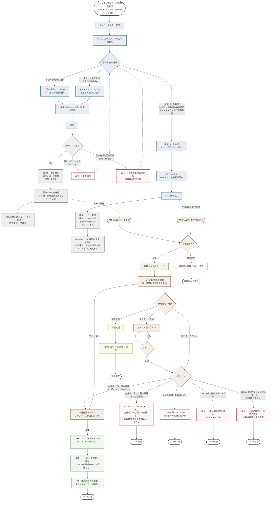
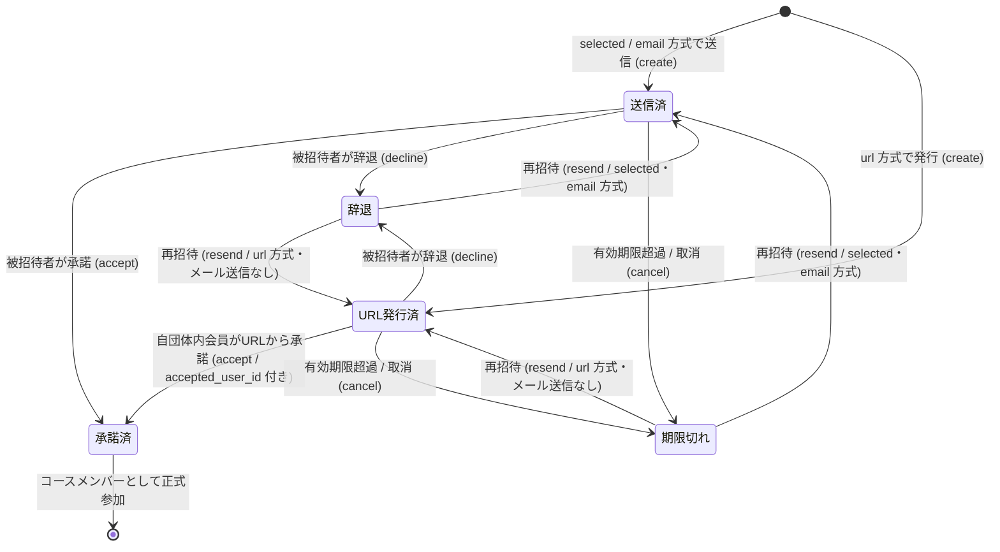

# コースへのメンバー招待フロー

対応ユースケース: UC-15(コースメンバー招待)、加えて被招待者側フロー

## 重要な前提

### 前提1: コースメンバーの団体所属制約

**コースメンバー(共同編集者)は、コース主催者と同じ団体に所属する会員のみ。**

- コース主催者は団体所属を前提とする(無所属会員はコースを作らない)
- コースメンバーも主催者と同じ団体に所属する必要がある
- 団体管理者が介入してメンバーを招待する場合も、同じ制約が適用される(上位権限としても他団体・無所属の会員は招待できない)

これにより、コースは主催者の所属団体内における共同作業の場として閉じる。

### 前提2: コース招待は団体招待の完了が前提

**コース招待は、被招待者が既にコース主催者と同じ団体に所属していることを前提とする。**

被招待者がアカウントを持っていない、または団体に所属していない場合は、
コース招待のスコープ外となる。そのケースに対応するには、先に団体招待
(招待フロー_団体.md / UC-03 / UC-50 / UC-51)で団体所属を確立する
必要がある。

これにより、コース招待フローから「アカウント未取得」「団体未所属」の
分岐が排除され、被招待者側フローが大幅に簡素化される。

## メインフロー

```mermaid
flowchart TB
    A_START([コース主催者または団体管理者が<br/>A-MC2/A-C2 のメンバータブを開く]) --> A1[メンバータブで ＋招待]
    A1 --> A2[A-CM2 コースメンバー招待画面へ]
    A2 --> A3{招待方法を選択}
    A3 -->|自団体会員から選択| A4[自団体会員リストから<br/>タグ形式で複数選択]
    A3 -->|メールアドレスで招待<br/>※自団体内のみ| A5[メールアドレスを入力<br/>複数可・改行区切り]
    A3 -->|招待URLを発行<br/>※自団体内会員のみ承諾可<br/>※ワンタイム・発行数無制限| A6[招待URLを生成<br/>クリップボードにコピー]
    A4 --> A7[招待メッセージ・有効期限を設定]
    A5 --> A7
    A6 --> A7b[A7 スキップ:<br/>URL方式は主催者が配布]
    A7 --> A8[送信]
    A7b --> A8b[URL発行完了]

    A8 --> S1{バリデーション}
    S1 -->|既にこのコースの<br/>メンバー| E1[エラー: 重複招待]
    S1 -->|招待先が他団体所属<br/>または無所属| E2[エラー: 主催者と同じ団体の<br/>会員のみ招待可能]
    E1 -.-> A3
    E2 -.-> A3
    S1 -->|OK| S2[招待トークン発行<br/>招待レコード作成<br/>状態=送信済]
    S2 --> S3[招待メールを送信<br/>※自団体会員選択方式でもメール送信]
    S3 --> S4[A-CM3 発行済みコース招待一覧に<br/>招待中 として表示]

    A8b --> S2b[招待トークン発行<br/>招待レコード作成<br/>状態=URL発行済<br/>※ワンタイム]
    S2b --> S4b[A-CM3 に URL発行中 として表示<br/>※承諾されるまで誰がクリックするかは確定せず]

    S3 -.->|メール配送| B1([被招待者がメール受信])
    A8b -.->|主催者がURLを配布| B1b([被招待者がURLを受け取る])

    B1 --> B2{有効期限内?}
    B1b --> B2
    B2 -->|期限切れ| B2a[期限切れ画面 / フロー終了]
    B2 -->|有効| B3[招待リンクをクリック]
    B3 --> B4[コース招待承諾画面<br/>コース情報と主催者を表示]
    B4 --> B5{被招待者の選択}
    B5 -->|未ログインなら| B6[ちょい英語ログイン]
    B5 -->|辞退する| B8[辞退処理]

    B6 --> B9{ログイン}
    B9 -->|失敗| B6
    B9 -->|成功| B10{バリデーション}
    B5 -->|ログイン済みなら| B10

    B10 -->|主催者と同じ団体所属<br/>かつ既存メンバーでない| B12[承諾確認モーダル<br/>このコースに参加しますか?]
    B10 -->|主催者と異なる団体所属<br/>または無所属| E3[エラー: このコースのメンバーは<br/>主催者と同じ団体の会員のみ。<br/>先に団体招待で参加してください]
    B10 -->|既にこのコースのメンバー| E4[エラー: 既にメンバー<br/>※承諾時の重複チェック]
    B10 -->|URL方式で他者が先に承諾済| E5[エラー: URLは既に使用済み<br/>※ワンタイム制]
    B10 -->|selected 指名でログインユーザーが<br/>宛先本人でない| E6[エラー: 別のアカウント宛ての招待<br/>※指名招待は本人限定]

    B12 -->|キャンセル| B4
    B12 -->|承諾| B14[コースメンバー関係を作成<br/>コース o-- Account メンバー]
    B14 --> B15[招待レコードを 承諾済 に更新<br/>※URL方式は他URLにも影響しない]
    B15 --> B16[コースの参加完了画面<br/>または B-02 コース詳細へ]
    B16 --> B_END([フロー完了])

    B8 --> B8a[招待レコードを 辞退 に更新]
    B8a --> B_END3([辞退完了])

    E3 --> B_END2([フロー中断])
    E4 --> B_END5([フロー中断])
    E5 --> B_END6([フロー中断])
    E6 --> B_END7([フロー中断])
    B2a --> B_END4([期限切れで終了])

    classDef inviterStyle fill:#e8edf4,stroke:#2a5a7a,stroke-width:1.5px
    classDef systemStyle fill:#eeeeee,stroke:#555,stroke-width:1px
    classDef inviteeStyle fill:#f4eee8,stroke:#7a5a2a,stroke-width:1.5px
    classDef errorStyle fill:#fff6f6,stroke:#a33,stroke-width:1.5px
    classDef successStyle fill:#f0f7ef,stroke:#7aa07a,stroke-width:1.5px
    classDef declineStyle fill:#fbf9e8,stroke:#a89a2a,stroke-width:1px
    classDef startEndStyle fill:#fff,stroke:#333,stroke-width:1.5px

    class A1,A2,A3,A4,A5,A6,A7,A7b,A8,A8b inviterStyle
    class S1,S2,S2b,S3,S4,S4b systemStyle
    class B1,B1b,B2,B3,B4,B5,B6,B9,B10,B12 inviteeStyle
    class E1,E2,E3,E4,E5,E6,B2a errorStyle
    class B14,B15,B16 successStyle
    class B8,B8a declineStyle
    class A_START,B_END,B_END2,B_END3,B_END4,B_END5,B_END6,B_END7 startEndStyle
```

## 招待状態の遷移

```mermaid
stateDiagram-v2
    [*] --> 送信済: selected / email 方式で送信 (create)
    [*] --> URL発行済: url 方式で発行 (create)
    送信済 --> 承諾済: 被招待者が承諾 (accept)
    URL発行済 --> 承諾済: 自団体内会員がURLから承諾 (accept / accepted_user_id 付き)
    送信済 --> 辞退: 被招待者が辞退 (decline)
    URL発行済 --> 辞退: 被招待者が辞退 (decline)
    送信済 --> 期限切れ: 有効期限超過 / 取消 (cancel)
    URL発行済 --> 期限切れ: 有効期限超過 / 取消 (cancel)
    期限切れ --> 送信済: 再招待 (resend / selected・email 方式)
    期限切れ --> URL発行済: 再招待 (resend / url 方式・メール送信なし)
    辞退 --> 送信済: 再招待 (resend / selected・email 方式)
    辞退 --> URL発行済: 再招待 (resend / url 方式・メール送信なし)
    承諾済 --> [*]: コースメンバーとして正式参加
```

> コース招待 API にレコード削除(delete)は無いため、終端への「レコード削除」
> 遷移は持たない。取消(cancel)は送信済 / URL発行済 → 期限切れ の状態変更で
> レコードは残る。URL方式の承諾は API 上 `accepted`(`accepted_user_id` 付き)
> として表現されるため、旧「使用済」状態は `承諾済` に畳んだ。`url_issued`
> (URL発行済)は再招待(resend)の直接の対象ではない(resend の対象は
> 期限切れ / 辞退のみ)。承諾・辞退・期限切れ・取消へは遷移する。
>
> 再招待の戻り先は方式によって分かれる。`selected` / `email` 方式は `sent`、
> `url` 方式は `url_issued` に戻る(`course_invitation.md` POST `/resend`)。
> したがって URL 招待も、取消・期限切れを経たあと再招待で復活しうる。
> このとき token は再生成されず、同じ招待URLの有効期限が延長される
> (設計ポイント8)。

## 招待状態の表示と操作(A-CM3 発行済みコース招待一覧)

コースメンバー一覧(A-CM1 タブ)には、コースに参加済みのメンバーのみを
表示する。発行済みのコース招待は、A-CM1 から[招待の一覧]で遷移する
発行済みコース招待一覧(A-CM3)で管理する。

A-CM3 のステータス表示と操作(コース招待 API に対応):

| status | A-CM3 での表示 | 可能な操作(対応API) |
|---|---|---|
| sent(送信済) | 「招待中」バッジ | 取消(`cancel`) |
| url_issued(URL発行済) | 「URL発行中(未使用)」バッジ | 招待URLの表示、取消(`cancel`) |
| accepted(承諾済) | 「承諾済み」バッジ(履歴) | なし(メンバーとして A-CM1 に存在) |
| declined(辞退) | 「辞退」バッジ | 再招待(`resend`) |
| expired(期限切れ) | 「期限切れ」バッジ | 再招待(`resend`) |

- URL方式の承諾は、API 上は `accepted`(`accepted_user_id` 付き)として
  表現される(本ドキュメントの状態遷移図の「使用済」に相当)。A-CM3 では
  他の承諾済みと同様に履歴として表示し、承諾者本人はメンバーとして A-CM1
  に並ぶ
- `url_issued` に対する管理者の操作は**招待URLの表示と取消(`cancel`)**。
  再招待(`resend`)は url_issued に対しては使えない(対象は期限切れ / 辞退のみ)
  が、取消・期限切れを経た `url` 方式のレコードは再招待でき、`url_issued` に
  戻る(同じ招待URLが再び有効になる。設計ポイント8)。被招待者による辞退は
  url_issued でも可能
- **招待URLの表示**: `url` 方式のレコードは `GET /list` が `token` を返すため、
  A-CM3 から招待URLを再表示・コピーできる(`selected` / `email` 方式は `token`
  が常に null)。再招待した場合も `POST /resend` が `token` を返す。表示対象は
  `url_issued` の行に限る(`expired` / `declined` / `accepted` の行では、無効な
  URLの誤配布を避けるため表示しない)。ワイヤーフレーム修正仕様 §10.3
- レコードの物理削除は無い(コース招待 API に delete が無いため)。`cancel`
  は `sent` / `url_issued` → `expired` に状態を変えるのみ
- 送信済(sent)の再送信は無い。`resend` の対象は `expired` / `declined` のみ
- 再招待は有効期限(`expires_days`)を指定する確認ダイアログを伴う(ワイヤーフレーム
  修正仕様 §10.3)。`url` 方式由来はメール送信がないため文言が分かれる

## 招待方法の詳細

### 1. 自団体会員から選択

- 主催者または団体管理者が、自団体内の会員を複数選択(タグ形式)
- UI は**2カラムの会員選択**(左 = 選択中チップ / 右 = 選択肢 + 絞り込み欄)。
  絞り込みはサーバーサイド検索: ユーザーID完全一致 / ニックネーム前方一致 /
  氏名前方一致の OR 検索。検索対象は**自団体所属・対象コースの
  メンバー以外・メール確認済み**(ワイヤーフレーム修正仕様 §10.0c。検索 API はメール合意 2026-07-27
  に基づく実装予定)
- 選択した各会員のメールアドレスに招待メールが送信される
  (内部的にはメールアドレスを使った招待と同じトークン発行フロー)
- 被招待者が事前に確定しているため、A-CM1 一覧では氏名で表示される

### 2. メールアドレスで招待

- メールアドレスを入力(複数可、改行区切り)
- 各アドレスに招待メールが送信される
- 被招待者が自団体所属の会員でない場合は、招待自体は発行できるが
  承諾時にエラー(前提1の制約)
- A-CM1 一覧では各アドレスごとに表示される

### 3. 招待URL方式

- 招待URLを発行し、主催者がクリップボードからコピーして手動配布
- **ワンタイム制**: URL1つにつき1人の承諾で消費される。承諾後は
  そのURLは無効化される(他の人がアクセスしてもエラー)
- **発行数は無制限**: コースあたり何個でも発行可能
- URLを受け取った人が **主催者と同じ団体所属の会員** であれば承諾可能、
  それ以外はエラー
- A-CM1 一覧では「URL発行中(未使用)」として1レコードずつ表示

### URL方式運用パターン例

- 主催者が複数の特定メンバーに別個に配布したい場合 → 複数発行
- 主催者がチャットに貼る場合 → 必要な人数分だけ発行(ワンタイム消費を
  考慮して、招待したい人数分の URL を生成して別々に配布する運用が
  推奨される)

## 団体招待フローとの差分

| 項目 | 団体招待(UC-03) | コース招待(UC-15) |
|---|---|---|
| 招待方法 | メール / 既存ID指名 / CSV一括 | 自団体会員選択 / メール / URL発行(ワンタイム・無制限) |
| 被招待者の所属制約 | 別団体所属者は招待不可(1会員1団体) | **主催者と同じ団体所属の会員のみ**(他団体・無所属は招待不可) |
| 招待元の権限 | 団体管理者のみ | 主催者本人 または 団体管理者 |
| 承諾時の効果 | Account.所属団体 / 団体ロール がセット | コース o-- Account メンバー関係が生成 |
| URL発行方式 | なし | あり(ワンタイム・無制限、自団体内のみ承諾可) |
| 「自団体会員から選択」方式 | — | あり(主催者・管理者ともに使用可、メール送信あり) |
| 前提 | アカウントなし/団体未所属でも招待可(招待フローでアカウント作成・団体加入を行う) | **アカウント有り・団体所属済みが前提**(団体招待が先に完了している) |

## 招待方式の設計根拠(メモ)

上表の非対称(コース側に CSV 一括が無く、URL 発行方式がある)は、
**被招待者の母集団が団体の内側に閉じている**(前提1・前提2)ことの帰結である。

- **CSV 一括が無い理由**: 名簿は既にシステム内(自団体の会員一覧)にある。
  外部ファイルから取り込む理由がなく、「自団体会員から選択」の複数選択が
  一括指定の役割を果たす(対象はメール確認済み・メールアドレス登録済みの
  会員のみ〔設計ポイント9〕、作成は1リクエスト最大50件〔設計ポイント7〕の
  範囲で)。CSV はシステム外の名簿を中に入れる道具であり、その必要があるのは
  団体招待側だけ(招待フロー_団体.md の同名メモを参照)
- **URL 方式が成立する理由**: 承諾時の同一団体チェック(前提1)により、
  URL がチャット等で団体外に漏れても団体外の人間は承諾できない。団体という
  セキュリティ境界が既に存在するからこそ、承諾者を発行時点で特定しない
  配布手段を許容できる。コース参加は共同編集メンバー関係を作るだけの
  軽い操作で、ロール・部署のような個人別属性の事前割り当ても不要。
  方式ごとの承諾資格は **`selected` = 本人限定(承諾時に本人一致チェック)/
  `email`・`url` = リンクの所持 + 同一団体チェック**という対比になる
  (設計ポイント9。招待フロー_団体.md 設計ポイント2 と同じ構造)
- **依存関係の注意**: URL 方式の安全性は前提1・前提2 に依存する。将来、
  コース招待を団体外・アカウント未取得者に開放する場合は、この前提ごと
  崩れるため URL 方式の再検討が必要(経緯: 初期案ではアカウント未取得・
  団体未所属の被招待者もフローに含んでいたが、前提1〔コースを主催者の
  所属団体内での共同作業の場として閉じる〕と前提2〔被招待者側フローの
  簡素化〕の導入によりスコープ外とした。history 62cb317)

## 重要な設計ポイント

1. **コースメンバーは主催者と同じ団体所属の会員のみ**
   - 自団体内会員のみ招待可能
   - 他団体所属者・無所属会員は招待不可
   - 団体管理者の上位権限としても、この制約は外れない
   - 動機: コースは主催者の所属団体内での共同作業の場として閉じる

2. **コース招待は団体招待の完了が前提(前提2)**
   - 被招待者がアカウントを持っていない場合や団体未所属の場合は、
     先に団体招待(UC-03)で団体加入を完了させる必要がある
   - これによりコース招待フローから「アカウント未取得 → アカウント作成」
     や「新規アカウント作成 → 団体未所属 → コース招待エラー」の連鎖を
     排除できる
   - 被招待者は招待リンクをクリックした際、ログイン済みであれば
     そのまま承諾フローに進み、未ログインならログインした後に
     承諾フローに進む

3. **招待URL方式: ワンタイム + 無制限発行**
   - URL1つにつき1人の承諾で消費される
   - 発行数はコースあたり無制限
   - URLを受け取った人が **主催者と同じ団体所属の会員** であれば承諾可能、
     それ以外はエラー(承諾時に検証)
   - 同じ URL に複数人がアクセスする可能性があるため、最初に承諾した
     1人だけが成功し、それ以降は「使用済」エラー
   - A-CM1 一覧では各 URL ごとに1レコード(「URL発行中(未使用)」)
     として表示

4. **自団体会員選択方式でもメール送信を必須とする**
   - 内部的にはメール経由の招待と同じトークン発行フローを踏み、
     対象会員のメールアドレスに招待メールを送信する
   - 「コース招待通知一覧」画面のような代替案は採用しない(設計判断
     により決定)

5. **重複チェックは招待発行時・承諾時の二段階で実施**
   - 招待発行時: 被招待者が既にコースメンバーであればエラー
   - 承諾時: 招待発行後にメンバーに追加された場合に備えて再チェック
   - URL方式の場合はそもそも被招待者が事前に確定しないため、承諾時の
     チェックが特に重要

6. **団体管理者が介入してメンバーを招待する場合**
   - 主催者本人と同じ範囲(主催者と同じ団体内の会員のみ)で招待可能
   - 団体管理者の介入編集権限は、主催者と同じ範囲で招待操作を行えるように
     するものであり、招待範囲を拡張するものではない

7. **二重 pending の禁止(発行時ブロック・API 実装済み)**
   - `selected` / `email` 方式では、同一コース×同一宛先に有効(`sent` かつ
     期限内)な招待が既にある場合、新規発行を弾く(`invitation.ALREADY_PENDING`)。
     同一リクエスト内の宛先重複も弾く(`invitation.DUPLICATE_IN_REQUEST`)
   - `url` 方式は対象外(被招待者が事前に確定しないため。発行数無制限の
     方針どおり)
   - 「届かない/もう一度送りたい」への対処は団体招待(招待フロー_団体.md
     設計ポイント4)と同じ既存導線: A-CM3 で当該 `sent` を取消(`cancel` →
     `expired`)してから新規発行、または `expired` / `declined` からの再招待
     (`resend`)。状態 enum・状態遷移・操作は現状維持
   - なお `selected` / `email` 方式の作成は1リクエストあたり最大50件の
     バッチで、1件でもエラーがあればその時点で全件を中断する(API 仕様)

8. **取消(cancel)と再招待(resend)の関係**
   - `cancel` は当該招待を `expired` にし、招待URL(招待メールのリンク、
     および `url` 方式で配布したURL)はその時点で無効になる
   - `resend` は同一レコードを**同一トークンのまま**再有効化する。`url` 方式の
     再有効化では token は再生成されず、同じ招待URLの有効期限が延長される
     (`course_invitation.md` POST `/resend`)。戻り先は `selected` / `email`
     方式が `sent`、`url` 方式が `url_issued`
   - 取消が「そのURLを今後使わせない」意図であった場合は**再招待しない**。
     当該レコードは `expired` のまま残し、新規に招待を発行する
     (`cancel` + `create`)。二重 pending の禁止は `sent` かつ期限内のみを
     対象とするため、期限切れレコードが残っていても新規発行は妨げられない
   - `url` 方式は配布経路を主催者が管理できない(転送・保存された複製が残る)
     ため、団体招待よりこの使い分けの重要度が高い
   - 主催者・管理者が操作時点で判断できるよう、A-CM3 の再招待は確認ダイアログを
     伴う(ワイヤーフレーム修正仕様 §10.3)
   - 団体招待も同じ扱い(招待フロー_団体.md 設計ポイント6)

9. **`selected` 方式で指名できる会員の前提**
   - 指名対象は**メール確認済み・メールアドレス登録済み**の会員に限る
     (未確認/未登録は `target_user.INVALID`)。指名招待でも招待メールを送るため
   - 団体招待の会員ID指名(招待フロー_団体.md 設計ポイント2)と同じ前提
   - **`selected` 指名の承諾は本人限定**: 承諾時にログインユーザーとの一致を
     チェックする(`POST /accept` の `invitation.FORBIDDEN`)。`email` / `url`
     方式にこの照合は無く、リンクの所持と承諾時の同一団体チェック(前提1)が
     承諾資格となる

## 設計判断(打ち合わせで決定済み)

1. **招待URL方式の使い回し**: **ワンタイム**(URL1つにつき1人の承諾)
2. **URL方式の発行数上限**: **無制限**
3. **自団体会員選択方式のメール送信**: **必須**(代替案不採用)
4. **被招待者が既にコースメンバーだった場合のフェイルセーフ**:
   **招待発行時、承諾時ともにチェック**
5. **投稿者制限との整合**: コースの投稿者制限の「一般(メンバー以外
   も投稿可)」は **廃止**。コースの投稿者制限は `主催者のみ / メンバー`
   の2値とする(ユースケース仕様書 UC-13 で修正)
6. **アカウント未取得 / 団体未所属の被招待者の扱い**: コース招待の
   スコープ外とし、先に団体招待(UC-03)で団体加入を完了させる前提と
   する(前提2 / 上記設計ポイント2)

## 本フェーズ対象外 / 将来拡張

- コース招待の団体外・アカウント未取得者への開放(検討する場合は URL 方式の
  安全性の前提が崩れる — 「招待方式の設計根拠(メモ)」の依存関係の注意を参照)
- 招待URLの QR コード発行
- 招待URLのアクセス解析(何人が見たか、承諾率など)
- 大量招待時のレート制限
- 主催者不在時の主催者再選定(現主催者退職等のケース) ── UC-15a の
  運用論点で別途扱う
