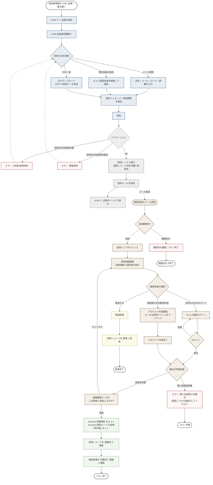
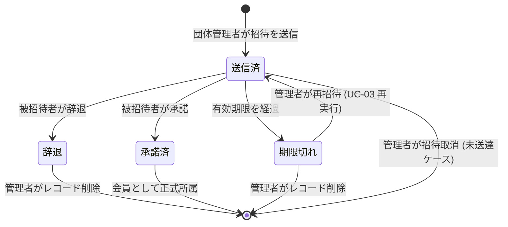

# 団体へのメンバー招待フロー

対応ユースケース: UC-03(団体管理者側)、UC-50(被招待者がアカウント既存で承諾)、UC-51(被招待者がアカウント未取得で作成+承諾)、UC-52(招待状態管理)

## メインフロー

## 招待状態の遷移

## A-M1 会員一覧での招待状態の表示(UC-52)

| 招待状態 | A-M1 での表示 | 可能な操作 |
|---|---|---|
| 送信済 | 氏名 + 「招待中」バッジ | 招待取消 / 再送信 |
| 承諾済 | 通常の会員レコード(バッジなし) | ロール変更 / 削除 |
| 期限切れ | 氏名 + 「期限切れ」バッジ | 再招待 / レコード削除 |
| 辞退 | 氏名 + 「辞退」バッジ | レコード削除のみ |

## 重要な設計ポイント

1. **アカウント既存/未取得の判定はシステム側で行わない**
   - 被招待者自身が「お持ちの方はログイン / 未取得の方は新規作成」を選択する
   - これにより、招待メール発行時のメールアドレス照合や、中間判定画面が不要

2. **1会員1団体制約**
   - 招待時のバリデーションと、被招待者の承諾時の二段階でチェック
   - 招待時: 別団体所属なら招待送信自体をブロック
   - 承諾時: 招待発行後に別団体に所属した場合に備えて、承諾時にも再チェック

3. **CSV一括 = 招待メールの一括送信**
   - CSV の1行ごとに独立した招待レコード・トークンを発行
   - 各行について個別にメール送信を行う
   - 行単位でバリデーションを実施

## 設計判断が必要な事項

1. **招待トークンの仕様**: UUIDv4 / 有効期限付きJWT / ワンタイムトークン 等
2. **期限切れの再招待**: 同じトークンを再送するか、新規トークンを発行して既存レコードを差し替えるか
3. **辞退の取り扱い**: 辞退レコードを一定期間保持するか、即時削除するか。同一メールで再招待を許すか
4. **既に別団体所属者への招待時**: 招待そのものを送らない(実装案) / 送るが被招待者側でエラー表示
5. **CSV 一括招待の失敗処理**: 100 件中 3 件失敗した場合、97 件は送信するか、全体をロールバックするか
6. **既存会員ID指名招待時**: 招待メールは送らずに対象会員の「招待通知一覧」的な画面で通知するか、それともメールは送るか
7. **アカウント作成後の招待承諾への復帰**: アカウント作成完了後に招待承諾画面に戻る導線の具体設計(トークンの引き回し方、セッション/クエリパラメータ等)
8. **被招待者が辞退後、同じ団体から再招待された時の扱い**: 拒絶するか、再度案内するか

## 本フェーズ対象外 / 将来拡張

- 招待リンクのセキュリティ強化(デバイス検証、IPフィルタリング等)
- 招待履歴の監査ログ
- 招待数の上限管理(団体の契約プランに応じて)
