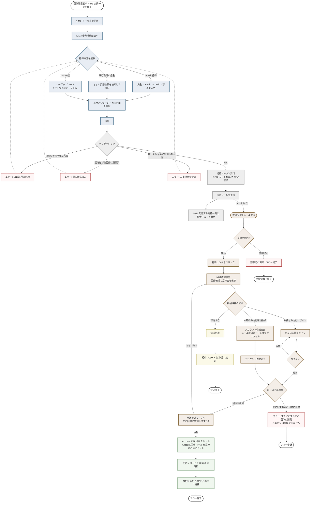
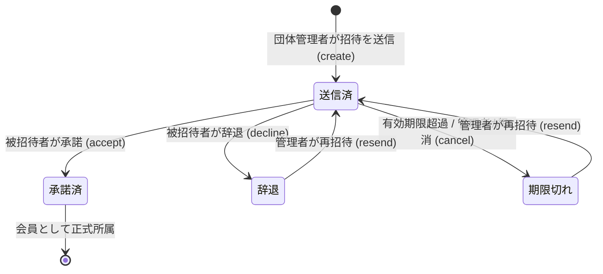

# 団体へのメンバー招待フロー

対応ユースケース: UC-03(団体管理者側)、UC-50(被招待者がアカウント既存で承諾)、UC-51(被招待者がアカウント未取得で作成+承諾)、UC-52(招待状態管理)

## メインフロー

```mermaid
flowchart TB
    A_START([団体管理者が A-M1 会員一覧を開く]) --> A1[A-M1 で ＋会員を招待]
    A1 --> A2[A-M3 会員招待画面へ]
    A2 --> A3{招待方法を選択}
    A3 -->|メール招待| A4[氏名・メール・ロール・部署を入力]
    A3 -->|既存会員ID指名| A5[ちょい英語会員を検索して選択]
    A3 -->|CSV一括| A6[CSVアップロード<br/>1行ずつ招待データ生成]
    A4 --> A7[招待メッセージ・有効期限を設定]
    A5 --> A7
    A6 --> A7
    A7 --> A8[送信]

    A8 --> S1{バリデーション}
    S1 -->|招待先が別団体に所属| E1[エラー: 1会員1団体制約]
    S1 -->|招待先が自団体に所属済| E2[エラー: 既に所属済み]
    S1 -->|同一宛先に有効な招待が存在| E4[エラー: 二重招待の禁止]
    E1 -.-> A3
    E2 -.-> A3
    E4 -.-> A3
    S1 -->|OK| S2[招待トークン発行<br/>招待レコード作成 状態=送信済]
    S2 --> S3[招待メールを送信]
    S3 --> S4[A-M4 発行済み招待一覧に<br/>招待中 として表示]

    S3 -.->|メール配送| B1([被招待者がメール受信])
    B1 --> B2{有効期限内?}
    B2 -->|期限切れ| B2a[期限切れ画面 / フロー終了]
    B2 -->|有効| B3[招待リンクをクリック]
    B3 --> B4[招待承諾画面<br/>団体情報と招待者を表示]
    B4 --> B5{被招待者の選択}
    B5 -->|お持ちの方はログイン| B6[ちょい英語ログイン]
    B5 -->|未取得の方は新規作成| B7[アカウント作成画面<br/>メールは招待アドレスをプリフィル]
    B5 -->|辞退する| B8[辞退処理]

    B6 --> B9{ログイン}
    B9 -->|失敗| B6
    B9 -->|成功| B10{現在の所属状態}
    B7 --> B11[アカウント作成完了]
    B11 --> B10

    B10 -->|団体未所属| B12[承諾確認モーダル<br/>この団体に参加しますか?]
    B10 -->|既にいずれかの団体に所属| E3[エラー: すでにいずれかの団体に所属<br/>この招待は承諾できません]

    B12 -->|キャンセル| B4
    B12 -->|承諾| B14[Account.所属団体 をセット<br/>Account.団体ロール を招待時の値にセット]
    B14 --> B15[招待レコードを 承諾済 に更新]
    B15 --> B16[被招待者を 所属完了 画面に遷移]
    B16 --> B_END([フロー完了])

    B8 --> B8a[招待レコードを 辞退 に更新]
    B8a --> B_END3([辞退完了])

    E3 --> B_END2([フロー中断])
    B2a --> B_END4([期限切れで終了])

    classDef inviterStyle fill:#e8edf4,stroke:#2a5a7a,stroke-width:1.5px
    classDef systemStyle fill:#eeeeee,stroke:#555,stroke-width:1px
    classDef inviteeStyle fill:#f4eee8,stroke:#7a5a2a,stroke-width:1.5px
    classDef errorStyle fill:#fff6f6,stroke:#a33,stroke-width:1.5px
    classDef successStyle fill:#f0f7ef,stroke:#7aa07a,stroke-width:1.5px
    classDef declineStyle fill:#fbf9e8,stroke:#a89a2a,stroke-width:1px
    classDef startEndStyle fill:#fff,stroke:#333,stroke-width:1.5px

    class A1,A2,A3,A4,A5,A6,A7,A8 inviterStyle
    class S1,S2,S3,S4 systemStyle
    class B1,B2,B3,B4,B5,B6,B7,B9,B10,B11,B12 inviteeStyle
    class E1,E2,E4,E3,B2a errorStyle
    class B14,B15,B16 successStyle
    class B8,B8a declineStyle
    class A_START,B_END,B_END2,B_END3,B_END4 startEndStyle
```

### エラー表示に関する注記(発行時 / 承諾時)

フロー図では、発行時のバリデーション(S1)を理由別に E1(1会員1団体制約)・
E2(既に自団体所属済み)・E4(二重招待の禁止)として分岐して示す。これは状態を
理解しやすくするための表現で、**実装のエラーコードとは一対一に対応しない**。

- **発行時(A-M3)**: E1 と E2 は、API では単一のエラーコードで返る
  (`target_user_id` / `email` の `ALREADY_JOINED`。他団体所属・自団体所属済みを
  区別しない。`org_invitation.md`)。したがって A-M3 の**エラーメッセージは
  理由によらず同一表現**とする:
  > このユーザーは新規に団体会員として招待できません(すでにいずれかの団体に
  > 所属しています)。

  E4 は別コード(`ALREADY_PENDING`)で返るため、専用の文言を出せる:
  > この宛先には有効な招待がすでにあります。取消してから送り直すか、期限切れ後に
  > 再招待してください。

- **承諾時(IV-1)**: 承諾者自身が既にいずれかの団体に所属している場合は
  `POST /accept` が `org.ALREADY_JOINED` を返す(フロー図 E3)。これは被招待者に
  向けた表示で、発行時とは対象も画面も異なる:
  > すでにいずれかの団体に所属しているため、この招待を承諾できません。

- **コース招待との差分**: コース招待は、別団体・無所属(`DIFFERENT_ORG`)と
  既にメンバー / 主催者本人(`ALREADY_MEMBER`)を**別コードで返す**
  (`course_invitation.md`)。団体側のような1本化は不要で、フロー図の分岐どおりに
  文言を分けられる。

> 文言は要点(招待/承諾できないこと、理由が所属状態にあること)が伝わる範囲で
> 調整可。「すでに団体に所属しています」だと自団体所属と誤読されうるため、
> 他団体所属でも弾かれる事実に合わせて「いずれかの団体に」とした。

## 招待状態の遷移

```mermaid
stateDiagram-v2
    [*] --> 送信済: 団体管理者が招待を送信 (create)
    送信済 --> 承諾済: 被招待者が承諾 (accept)
    送信済 --> 辞退: 被招待者が辞退 (decline)
    送信済 --> 期限切れ: 有効期限超過 / 管理者が取消 (cancel)
    期限切れ --> 送信済: 管理者が再招待 (resend)
    辞退 --> 送信済: 管理者が再招待 (resend)
    承諾済 --> [*]: 会員として正式所属
```

> 招待 API にレコード削除(delete)は無いため、辞退・期限切れからの「レコード
> 削除」遷移は持たない。取消(cancel)は送信済 → 期限切れ の状態変更であり、
> レコードは残る。辞退・期限切れはいずれも再招待(resend)で送信済に戻せる。

## 招待状態の表示と操作(A-M4 発行済み招待一覧 / UC-52)

会員一覧(A-M1)には、承諾済みで団体に所属している会員のみを表示する。
発行済みの招待(送信済・期限切れ・辞退、および承諾済の履歴)は、A-M1 から
[招待の一覧]で遷移する発行済み招待一覧(A-M4)で管理する。招待は会員とは
別のライフサイクルを持つため、両者を画面で分離する。

A-M4 のステータス表示と操作(団体招待 API に対応):

| status | A-M4 での表示 | 可能な操作(対応API) |
|---|---|---|
| sent(送信済) | 「招待中」バッジ | 取消(`cancel`) |
| expired(期限切れ) | 「期限切れ」バッジ | 再招待(`resend`) |
| declined(辞退) | 「辞退」バッジ | 再招待(`resend`) |
| accepted(承諾済) | 「承諾済み」バッジ(履歴) | なし(会員として A-M1 に存在) |

- レコードの物理削除は無い(招待 API に delete が無いため)。`cancel` は
  送信済 → 期限切れ に状態を変えるのみで、レコードは残る
- 送信済(sent)の再送信は無い。`resend` の対象は期限切れ / 辞退のみ
- 再招待は有効期限(`expires_days`)を指定する確認ダイアログを伴う。ダイアログでは
  同一の招待URLが再び有効になることを明示する(設計ポイント6 / ワイヤーフレーム
  修正仕様 §9.3)

## 重要な設計ポイント

1. **アカウント既存/未取得の判定はシステム側で行わない（アカウント軸）**
   - 被招待者自身が「お持ちの方はログイン / 未取得の方は新規作成」を選択する
   - これにより、アカウントの有無を判定して導線を出し分ける中間判定画面が不要
   - ここで省くのは**アカウント有無の判定**のみ。所属(1会員1団体)の照合とは別軸であり、設計ポイント2 の発行時チェックを妨げない

2. **1会員1団体制約（メンバーシップ軸）**
   - 招待時のバリデーションと、被招待者の承諾時の二段階でチェック
   - 招待時: 入力された会員ID／メールが既存アカウントに解決でき、別団体所属が判明したら招待送信をブロック(**会員ID指名・メール・CSV いずれも照合する**。未登録メールは所属が無いので通す)
   - 承諾時: 招待発行後の所属変化や、未登録メールが後でアカウント作成＋別団体加入したケースに備え、承諾時にも再チェック(`POST /accept` の `ALREADY_JOINED`)
   - 会員ID指名(`target_user_id`)の対象は、**メール確認済み・メールアドレス登録済み**の会員に限る(未確認/未登録は `target_user_id.INVALID`)。指名招待でも招待メールを送るため

3. **CSV一括 = 招待メールの一括送信**
   - CSV の1行ごとに独立した招待レコード・トークンを発行
   - 各行について個別にメール送信を行う
   - 行単位でバリデーションを実施

4. **二重 pending の禁止（発行時ブロック）**
   - 同一メールアドレス(解決できる場合)×同一団体に、**有効(`sent` かつ期限内)な招待が既にある場合、新規発行を弾く**(`email` / `target_user_id` の `ALREADY_PENDING`)。重複みなしは `sent` かつ期限内のみ(`expired` / `declined`、および `sent` のまま期限を過ぎたレコードは新規発行を妨げない)
   - エラー文言の趣旨: 「このメールアドレスには既に有効な招待があります。A-M4 で取消のうえ再発行、または期限切れ・辞退分を再招待してください」
   - 「届かない/紛失したのでもう一度送りたい」は、新オペレーションを設けず**既存導線で対応**する: A-M4 で当該 `sent` を取消(`cancel` → `expired`)してから新規発行、または `expired` / `declined` からの再招待(`resend`)。状態 enum・状態遷移・操作は現状維持(`lost` 等の新状態は作らない)

5. **団体所属 = 全アセット管理下の明示**
   - 団体に所属すると、被招待者のすべてのコンテンツ資産(所属前に作成したユニットを含む)が団体の管理下に置かれる
   - 承諾前のランディング(IV-1)でこれを明示する。外部公開ロックが有効(≠ off)な団体では、除外時のコース非帰属ユニットの管理者への移譲(UC-05)も併せて明示する(ワイヤーフレーム修正仕様 §8.6)
   - 原則の単一情報源はユースケース仕様書「システム前提 / 会員と団体の関係」

6. **取消(cancel)と再招待(resend)の関係**
   - `cancel` は当該招待を `expired` にする。この時点で招待URLは無効になる
   - `resend` は同一レコードを**同一トークンのまま**再有効化する。したがって
     再招待すると、以前配布した招待URL(転送・保存された複製を含む)が
     そのまま再び通る。有効期限も現在時刻から再設定される
   - 取消が「そのURLを今後使わせない」意図であった場合は**再招待しない**。
     当該レコードは `expired` のまま残し(旧URLは無効のまま)、新規に招待を
     発行する。二重 pending の禁止は `sent` かつ期限内のみを対象とするため、
     期限切れレコードが残っていても新規発行は妨げられない
   - 管理者はこの使い分けを操作時点で判断する必要があるため、A-M4 の再招待は
     確認ダイアログを伴う(ワイヤーフレーム修正仕様 §9.3)
   - コース招待も同じ扱い(`url` 方式の固有事項は 招待フロー_コース.md
     設計ポイント8)

## 設計判断(決定済み)

1. **招待トークンの仕様**: **UUID**。`GET /get` は UUID 形式でない token を
   `invitation.NOT_FOUND` として扱う(`org_invitation.md`)
2. **期限切れ・辞退からの再招待**: **同一トークンを再利用する**。`POST /resend`
   は `status` を `sent` に戻し `expires_at` を再設定してメールを再送するのみで、
   トークンを再発行しない(`org_invitation.md`)。取消は再招待までの無効化であり、
   再招待すると以前配布した招待URLがそのまま再び有効になる。詳細と使い分けは
   設計ポイント6
3. **辞退の取り扱い**: レコードは**保持する**(招待 API に delete が無い)。
   同一レコードからの再招待(`resend`)を許す。「招待状態の遷移」節を参照
4. **CSV 一括招待の失敗処理**: **全行ロールバック**。バリデーションエラーが
   1件でもあれば全行を作成しない。1リクエストあたり最大100行
   (`org_invitation.md` POST `/upload_csv`)。コース招待の
   「1件でもエラーがあれば全件中断」と同方針
5. **既存会員ID指名招待時のメール送信**: **送信する**。指名招待でも招待メールを
   送るため、`target_user_id` の対象はメール確認済み・メールアドレス登録済みの
   会員に限られる(設計ポイント2)
6. **アカウント作成後の招待承諾への復帰**: `token` を引き回し、完了後に
   IV-1(`?token=...`)へ戻る。単一情報源はワイヤーフレーム修正仕様 §8.4
7. **被招待者が辞退後、同じ団体から再招待された時の扱い**: **再度案内する**
   (`declined` からの `resend` を許す)。「招待状態の遷移」節を参照

## 実装設計上の判断事項

実装方式の選択に委ねる事項。要求として決着済みの範囲は上記「設計判断(決定済み)」
に置き、ここには残さない。要求仕様の調整が必要になった場合は、本節ではなく
該当する要求の記述側を改める。

- 現時点で該当なし

## 本フェーズ対象外 / 将来拡張

- 招待リンクのセキュリティ強化(デバイス検証、IPフィルタリング等)
- 招待履歴の監査ログ
- 招待数の上限管理(団体の契約プランに応じて)
